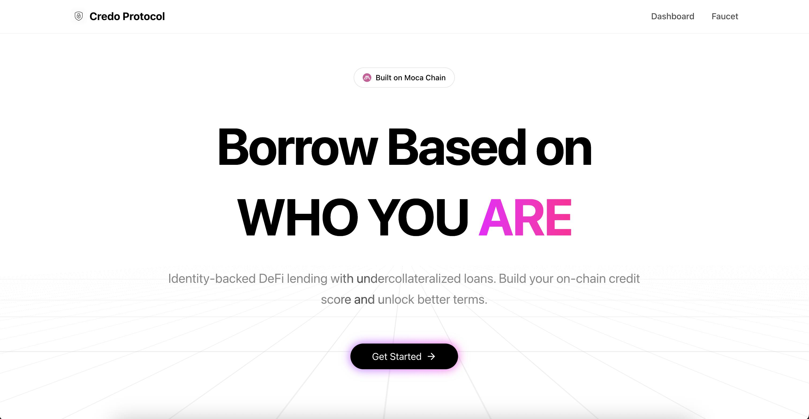

# Credo Protocol

> **Moca Network Proof of Build - Wave 3 Submission**  
> **Identity-Backed DeFi Lending with Official MOCA Integration**

Credo Protocol is an undercollateralized lending platform on Moca Chain Testnet, built for the Moca Network Proof of Build. It leverages official AIR Kit credential services to generate privacy-preserving, on-chain credit scores from verifiable credentials, unlocking fair access to capital in DeFi.

[](https://devnet-scan.mocachain.org)
[]()
[](https://credo-protocol.vercel.app)
[](LICENSE)



---

## 🎉 Wave 3 Updates (Oct 27, 2025)

### New Features

#### 🔐 Advanced Privacy-Preserving Credentials
- **Income Range Buckets**: Verify monthly income without revealing exact salary (50-180 pts)
- **Bank Balance (30-day avg)**: Prove financial stability in bucket ranges (40-150 pts)
- **Privacy-First Design**: Only range disclosed (e.g., "$5k-$10k"), exact amounts never revealed
- **10 Credential Types**: 4 income buckets + 4 balance buckets + 2 legacy types

#### 🏗️ Official MOCA Integration
- **AIR Kit Issuer DIDs**: Official registered issuer with reputation tracking
- **Decentralized Storage**: Credentials stored on MOCA Chain Storage Providers (MCSP)
- **Gas Sponsorship**: Zero-friction credential issuance (no MOCA tokens required!)
- **Ecosystem Interoperability**: Credentials discoverable by any MOCA dApp
- **Public Schema Registry**: Official schemas published for third-party use

#### 🎯 Crystal-Clear User Journey
- **Score Builder Wizard**: See exactly what unlocks your next tier
- **Real-Time Simulation**: Preview score changes before submitting credentials
- **Progress Tracking**: Visual progress bar showing "200 pts to next tier"
- **Transparent Breakdown**: View per-credential contributions with trust scores
- **AIR Wallet Integration**: View all credentials in one place

#### ⚡ Feature-Complete Protocol
- **Interest Accrual**: Time-based interest (5-18% APR based on credit tier)
- **Live Interest Display**: Watch interest accrue every 5 seconds in real-time
- **Dynamic APR**: Lower rates for higher scores (5% vs 18%)
- **Testnet Deployment**: Live on Moca devnet for testing and demonstration

#### 🌐 Ecosystem Integration
- **Composable Credit API**: Public `/api/score/:address` endpoint
- **CORS Enabled**: Any dApp can query credit scores
- **Leaderboard**: Track top credit scores across the network
- **Integration Guide**: Docs for third-party developers
- **True MOCA Participant**: Full integration with AIR Kit credential services

### Updated Contracts (Moca Devnet - Chain ID: 5151)

| Contract | Devnet Address | Version |
|----------|----------------|---------|
| **CreditScoreOracle v2** | `0xCB4404FC84Fe4Ddc29Db14553dae0Eb45BaE4259` | Wave 3 |
| **LendingPool v2** | `0x63b5F2a515Eaa7bAEDBe67eA8047212093Ed8B83` | Wave 3 |
| **MockUSDC** | `0xA057C871fA8Ff35fe3E72bE2060d7176Eca8391a` | Wave 3 |

[View on Explorer](https://devnet-scan.mocachain.org)

### What's Different from Wave 2

**Wave 2 (Devnet)** → **Wave 3 (Testnet)**
- 3 basic credentials → 10 bucketed credentials (privacy-first)
- Custom mock issuers → Official AIR Kit Issuer DIDs
- Local credential storage → MOCA Chain Storage Providers (MCSP)
- Users pay gas → Gas-sponsored credential issuance
- Isolated credentials → Interoperable MOCA ecosystem credentials
- Static scoring → Transparent on-chain registries
- No interest → Time-based interest accrual (5-18% APR)
- No UX guidance → Score Builder Wizard with simulation
- Isolated protocol → Composable API for ecosystem
- No leaderboard → Top 10 leaderboard with live updates

### Try It Now

1. **Visit**: [https://credo-protocol.vercel.app](https://credo-protocol.vercel.app)
2. **Login**: One-click with Moca ID (Google/Email/Wallet)
3. **Build Score**: Navigate to "Score Builder" tab
4. **See Your Tier**: View borrowing power and APR
5. **Check API**: `curl https://credo-protocol.vercel.app/api/score/YOUR_ADDRESS`

---

## 📊 Wave 3 Highlights

### For Users
- 🎯 **2x Better Terms**: Income credentials unlock up to 50% collateral (vs 150% standard)
- 🔒 **Privacy Protected**: Prove creditworthiness without revealing sensitive data
- 📈 **Clear Path**: Know exactly which credentials unlock better rates
- ⚡ **Real-Time Feedback**: Watch your score and interest update live

### For Developers
- 🔌 **Plug & Play**: Public API returns credit scores in one request
- 📚 **Well Documented**: Integration guide + code examples
- 🏗️ **Composable**: Use Credo scores in any dApp (DAOs, GameFi, NFTs)
- 🔗 **On-Chain**: All logic transparent and verifiable
- 🔐 **MOCA Native**: Uses official Issuer DIDs and credential schemas
- 🌐 **Discoverable**: Credentials appear in AIR Kit wallet

### For the Ecosystem
- 🚀 **Moca ID Adoption**: Requires Moca login, drives identity usage
- 🛠️ **AIR Kit Showcase**: Deep integration with Account + Credential Services
- 🎯 **True Integration**: Official MOCA infrastructure (not just SSO)
- 🧱 **Infrastructure Primitive**: Foundational layer for DeFi identity
- 💡 **Innovation**: Brings TradFi credit concepts to Web3
- ⚡ **Gas Sponsorship**: Demonstrates seamless UX with paymaster

---

## 📊 Project Status & Maturity

**Current Status: Testnet Demo (Wave 3)**

✅ **What This Project IS:**
- Feature-complete testnet demonstration
- Official MOCA ecosystem integration
- Comprehensive smart contract testing (104+ tests passing)
- Professional UI/UX for showcasing
- Fully functional on Moca Devnet
- Great for hackathons and proof-of-concept

⚠️ **What This Project is NOT (Yet):**
- Mainnet production-ready (contracts not audited)
- Using real financial data (still simulated credentials)
- Economically secure (no liquidation mechanism, price oracles needed)
- Battle-tested with real liquidity
- Regulatory compliant

**To Become Production-Ready, Would Need:**
1. Professional smart contract audit ($15k-50k)
2. Real credential integrations (Plaid, Experian, etc.)
3. Liquidation mechanism with keeper network
4. Price oracles for collateral valuation
5. Insurance fund for protocol solvency
6. Legal/compliance review
7. Gradual mainnet rollout with caps

**Current Best Use:** Educational demo, hackathon showcase, testnet experimentation

---

## 📺 Demo Links

- **🌐 Live Application**: [https://credo-protocol.vercel.app](https://credo-protocol.vercel.app)
- **🔗 Backend API**: [https://credo-protocol.onrender.com](https://credo-protocol.onrender.com)
- **📹 Demo Video**: [Watch on YouTube](https://www.youtube.com/watch?v=l05PbqsKPZY)
- **📊 Smart Contracts**: [Moca Chain Devnet Explorer](https://devnet-scan.mocachain.org)

---

## 🎯 The Problem We're Solving

### Traditional Finance (TradFi)
Credit systems are **opaque, centralized, and exclusionary**. Billions of people are locked out of capital markets due to lack of formal credit history.

### Current DeFi
While open and permissionless, DeFi lending is **capital-inefficient**. Protocols like Aave require **150% collateral** to borrow $100, making them unsuitable for genuine credit needs.

### Our Solution
Credo Protocol bridges this gap by creating an **identity-backed lending model**. Instead of relying solely on collateral, we assess creditworthiness based on verifiable on-chain and off-chain reputation.

### Key Innovation

**Traditional DeFi**: Borrow $100 → Need $150 collateral  
**Credo Protocol**: Borrow $100 → Need $50-$150 collateral (based on your credit score)

## ✨ Features

### Core Functionality
- **🔐 Seamless Login** - One-click Web3 SSO via Moca AIR Kit (Google/Email/Wallet)
- **🎫 Verifiable Credentials** - Submit proof of CEX history, employment, and stable balances
- **📊 On-Chain Credit Scoring** - Transparent 0-1000 scale with diversity bonuses
- **⚡ Dynamic Collateral** - 50-150% requirements based on your score
- **💰 Complete Lending Flow** - Supply, borrow, and repay USDC seamlessly

### Why Credo Protocol?

**For Users:**
- 🎯 Borrow **2x-3x more** with the same collateral compared to Aave/Compound
- 🔒 Keep your data **private** - prove creditworthiness without revealing sensitive information
- 🌍 Access DeFi **without crypto wealth** - your real-world reputation matters
- 📈 Build **portable credit history** that works across all dApps

**For the Moca Ecosystem:**
- 🚀 **Killer App** for Moca ID adoption (requires Moca login)
- 🛠️ **AIR Kit Showcase** - demonstrates both Account + Credential Services
- 🧱 **Composable Primitive** - other dApps can use Credo credit scores
- 💡 **Web3 Innovation** - shifts DeFi from "how much you have" to "who you are"

**For DeFi:**
- 💰 Unlocks **trillions in capital** currently locked due to over-collateralization
- 🌊 Brings **real-world identity** to on-chain finance
- 🔗 Creates **interoperability** between TradFi credentials and DeFi protocols
- 🎪 Enables **new primitives** (credit-gated DAOs, reputation-based insurance, etc.)

## 🚀 Deployed Contracts (Moca Chain Devnet)

| Contract | Address | Explorer |
|----------|---------|----------|
| **CreditScoreOracle** | `0x82Adc3540672eA15C2B9fF9dFCf01BF8d81F2Cd2` | [View](https://devnet-scan.mocachain.org/address/0x82Adc3540672eA15C2B9fF9dFCf01BF8d81F2Cd2) |
| **LendingPool** | `0x72efF02BF767b79369ea749dd7d57c143A92Cf09` | [View](https://devnet-scan.mocachain.org/address/0x72efF02BF767b79369ea749dd7d57c143A92Cf09) |
| **MockUSDC** | `0x76FdD416C70a9b51071C1751088d6715dD60d864` | [View](https://devnet-scan.mocachain.org/address/0x76FdD416C70a9b51071C1751088d6715dD60d864) |

## 📋 How It Works

```
1. Login with Moca ID (Google/Email/Wallet)
   ↓
2. Request Verifiable Credentials (CEX, Employer, Bank)
   ↓
3. Submit Credentials → Build Credit Score On-Chain
   ↓
4. Supply USDC as Collateral
   ↓
5. Borrow with Personalized Terms (Score-Based)
```

### Example User Journey

**Alice's Story**:
1. Logs in with her Google account via Moca AIR Kit ✅
2. Submits 3 credentials: CEX history, Employment proof, Stable balance ✅
3. Credit score calculated: **862/1000** ✅
4. Supplies $1,000 USDC as collateral ✅
5. **Can borrow up to $1,667 USDC** (60% collateral requirement) vs $667 in traditional DeFi 🎉

## 💎 Credit Scoring System

### Collateral Requirements by Score

| Credit Score | Collateral Required | Borrowing Power (per $100 collateral) |
|--------------|---------------------|----------------------------------------|
| 900-1000     | 50%                 | $200                                   |
| 800-899      | 60%                 | $167                                   |
| 700-799      | 75%                 | $133                                   |
| 600-699      | 90%                 | $111                                   |
| 500-599      | 100%                | $100                                   |
| 400-499      | 110%                | $91                                    |
| 300-399      | 125%                | $80                                    |
| 0-299        | 150%                | $67 (Standard DeFi)                    |

### Score Calculation

```javascript
Base Score: 500

+ Credential Type Weights:
  • Proof of Stable Balance: +100 points
  • Proof of CEX History: +80 points
  • Proof of Employment: +70 points

× Issuer Trust Score: 0-100%
× Recency Decay: 70-100% (based on credential age)

+ Diversity Bonus: 5% per unique credential type (up to 25%)

= Final Score (0-1000, capped)
```

**Example**:
- 3 credentials (CEX + Employment + Bank Balance)
- Full issuer trust (100%)
- Recent submissions (100% recency)
- Calculation: (500 + 80 + 70 + 100) × 1.15 = **862**

## 🏗️ Project Structure

```
Credo-Protocol/
├── pages/                      # Next.js pages
│   ├── index.js               # Landing page
│   ├── dashboard.js           # Main app dashboard
│   └── faucet.js              # Get test USDC
├── components/                 # React components
│   ├── auth/
│   │   └── ConnectButton.jsx  # Moca AIR Kit integration
│   ├── CreditScoreCard.jsx    # Display user's score
│   ├── CredentialMarketplace.jsx  # Request credentials
│   ├── LendingInterface.jsx   # Supply/Borrow/Repay
│   ├── SupplyModal.jsx        # Deposit collateral modal
│   ├── RepayModal.jsx         # Repay debt modal
│   └── ui/                    # shadcn/ui components
├── contracts/                  # Solidity smart contracts
│   ├── contracts/
│   │   ├── CreditScoreOracle.sol  # Credit scoring logic
│   │   ├── LendingPool.sol    # Lending/borrowing logic
│   │   └── MockUSDC.sol       # Test token with faucet
│   ├── scripts/
│   │   ├── deploy.ts          # Deploy all contracts
│   │   └── register-issuers.ts  # Setup credential issuers
│   └── test/                  # Contract tests
├── backend/                    # Express API server
│   └── src/
│       ├── issuers/           # Mock credential issuers
│       │   ├── MockBankIssuer.js
│       │   ├── MockEmployerIssuer.js
│       │   └── MockExchangeIssuer.js
│       └── routes/
│           └── credentials.js  # Credential API endpoints
├── hooks/
│   └── useAirKit.js           # AIR Kit React hook
├── lib/
│   ├── contracts.js           # Contract ABIs & addresses
│   ├── airkit.js              # AIR Kit initialization
│   └── utils.js               # Helper functions
└── docs/                       # Comprehensive documentation
    ├── OVERVIEW.md            # Technical architecture (670+ lines)
    ├── IMPLEMENTATION.md      # Implementation guide (1,900+ lines)
    ├── PHASE1-4.md            # Development progress
    └── SCORE-CALCULATOR.md    # Scoring algorithm details
```

## 🛠️ Tech Stack

### Frontend
- **Framework**: Next.js 15 + React 19
- **Styling**: Tailwind CSS + shadcn/ui
- **Web3**: Ethers.js v6
- **Auth**: Moca AIR Kit SDK (AIR Account Services)
- **Credentials**: AIR Credential Services framework

### Smart Contracts
- **Language**: Solidity 0.8.x
- **Framework**: Hardhat
- **Libraries**: OpenZeppelin v5
- **Network**: Moca Chain Devnet (Chain ID: 5151)

### Backend
- **Runtime**: Node.js + Express
- **Signing**: Ethers.js for EIP-191 signatures
- **Purpose**: Mock credential issuers for demo

## 🚀 Quick Start

### Prerequisites

- Node.js 18 or higher
- npm or yarn

### 1. Clone & Install

```bash
git clone https://github.com/YourUsername/Credo-Protocol.git
cd Credo-Protocol

# Install frontend dependencies
npm install

# Install backend dependencies
cd backend
npm install

# Install contract dependencies
cd ../contracts
npm install
```

### 2. Environment Setup

Create environment files from the examples:

```bash
# Frontend
cp .env.example .env.local
# Edit .env.local and add your NEXT_PUBLIC_PARTNER_ID from https://developers.sandbox.air3.com/

# Backend
cp backend/.env.example backend/.env
# No changes needed for development

# Contracts (optional - if deploying your own)
cp contracts/.env.example contracts/.env
# Add your private key if deploying
```

**Minimum Required**: Only the frontend `.env.local` needs configuration:
```bash
NEXT_PUBLIC_PARTNER_ID=your_partner_id_from_air_kit
```

All other variables have working defaults for the deployed contracts.

### 3. Start the Application

**Terminal 1 - Backend**:
```bash
cd backend
npm run dev
# → Running on http://localhost:3001
```

**Terminal 2 - Frontend**:
```bash
npm run dev
# → Running on http://localhost:3000
```

**Access**: Open http://localhost:3000 in your browser

### 4. Get Test Tokens

1. **Get MOCA for Gas**: Visit [Moca Devnet Faucet](https://devnet-scan.mocachain.org/faucet)
2. **Get Test USDC**: Visit `/faucet` page in the app (after logging in)

### 5. Try It Out!

1. **Login** - Click "Login with Moca ID" and choose Google/Email/Wallet
2. **Request Credentials** - Visit "Build Credit Score" tab, request all 3 credentials
3. **Check Score** - Your credit score updates automatically (base 500 + credentials)
4. **Supply USDC** - Go to "Lending Pool" tab, supply collateral
5. **Borrow** - Borrow up to your limit based on credit score
6. **Repay** - Pay back anytime to improve health factor

## 📊 Buildathon Progress

### ✅ Wave 2 Deliverables (COMPLETED - Oct 15, 2025)

**What's New This Wave:** The entire foundational infrastructure - from zero to a working, on-chain proof-of-concept demonstrating identity-based lending on Moca Chain.

#### 1. Smart Contracts (Deployed on Moca Devnet)
- ✅ **CreditScoreOracle.sol** - Verifies credentials & calculates credit scores (0-1000)
- ✅ **LendingPool.sol** - Dynamic collateral lending pool with 8 credit tiers
- ✅ **MockUSDC.sol** - Test token with faucet functionality
- ✅ Comprehensive test suite with 100% pass rate
- ✅ Deployed and verified on Moca Chain Devnet

#### 2. Backend Services (Live on Render)
- ✅ Express API server for credential issuance
- ✅ 3 Mock issuers (CEX, Employer, Bank)
- ✅ EIP-191 signature generation for verifiable credentials
- ✅ RESTful API endpoints for credential types and requests
- ✅ Production deployment with CORS configuration

#### 3. Frontend Application (Live on Vercel)
- ✅ **AIR Account Services Integration** - Seamless login with Google/Email/Wallet
- ✅ **AIR Credential Services Framework** - Request and submit verifiable credentials
- ✅ Beautiful landing page with animations (shadcn/ui + Framer Motion)
- ✅ Dashboard with real-time credit score display
- ✅ Credential marketplace (3 credential types)
- ✅ Lending interface (Supply/Borrow/Repay flows)
- ✅ Faucet page for test USDC tokens
- ✅ Real-time position monitoring & health factor tracking
- ✅ Fully responsive design (mobile-optimized)
- ✅ Comprehensive error handling & loading states
- ✅ Transaction feedback & confirmations

#### 4. Deployment & Infrastructure
- ✅ Frontend deployed to Vercel
- ✅ Backend deployed to Render
- ✅ Environment configuration for testnet
- ✅ CORS and security headers configured
- ✅ Public GitHub repository with documentation

---

### ✅ Wave 3 Deliverables (COMPLETED - Oct 27, 2025)

**What's New This Wave:** Complete transformation from basic MVP to feature-rich testnet protocol with official MOCA ecosystem integration, privacy-preserving credentials, interest-bearing loans, and composable credit infrastructure.

#### 1. Smart Contracts v2 (Redeployed on Moca Devnet)

**CreditScoreOracle v2** - Enhanced architecture with full transparency
- ✅ **On-chain registries** for issuers, credential types, and tiers (no more hardcoded values)
- ✅ **Dynamic trust scores** (0-100) for each issuer with activation/deactivation
- ✅ **Transparent score computation** with per-credential breakdown events
- ✅ **10 credential types** registered (4 income buckets + 4 balance buckets + 2 legacy)
- ✅ **Security hardening**: ReentrancyGuard, MAX_CREDENTIALS limit, gas optimization
- ✅ **66 comprehensive tests** - all passing

**LendingPool v2** - Interest-bearing loans with dynamic rates
- ✅ **Time-based interest accrual** (5-18% APR based on credit tier)
- ✅ **Global + per-user borrow indices** for accurate interest tracking
- ✅ **Tier-based APR** (Exceptional 5% → Very Poor 18%)
- ✅ **Health factor includes interest** (prevents undercollateralized positions)
- ✅ **Dust-tolerant repayment** (handles rounding errors gracefully)
- ✅ **38 tests including interest scenarios** - all passing

**Contract Addresses** (Moca Devnet - Chain ID: 5151)
- CreditScoreOracle: `0xCB4404FC84Fe4Ddc29Db14553dae0Eb45BaE4259`
- LendingPool: `0x63b5F2a515Eaa7bAEDBe67eA8047212093Ed8B83`
- MockUSDC: `0xA057C871fA8Ff35fe3E72bE2060d7176Eca8391a`

#### 2. Privacy-Preserving Credentials System

**Income Range Buckets** (4 tiers)
- ✅ **INCOME_HIGH**: $8k+/month (180 pts) - Highest weight!
- ✅ **INCOME_MEDIUM**: $5k-$8k/month (140 pts)
- ✅ **INCOME_LOW**: $3k-$5k/month (100 pts)
- ✅ **INCOME_MINIMAL**: Under $3k/month (50 pts)
- ✅ **Privacy guarantee**: Only bracket disclosed, never exact salary

**Bank Balance Buckets** (30-day average)
- ✅ **BANK_BALANCE_HIGH**: $10k+ average (150 pts)
- ✅ **BANK_BALANCE_MEDIUM**: $5k-$10k average (120 pts)
- ✅ **BANK_BALANCE_LOW**: $1k-$5k average (80 pts)
- ✅ **BANK_BALANCE_MINIMAL**: Under $1k average (40 pts)
- ✅ **Privacy guarantee**: Only range revealed, never exact amounts

**Legacy Credentials** (backward compatibility)
- ✅ CEX Trading History (80 pts)
- ✅ Employment Verification (70 pts)

#### 3. Official MOCA Ecosystem Integration (Phase 5)

**AIR Kit Credential Services** - Official integration
- ✅ **Official Issuer DID** registered in AIR Kit Dashboard
- ✅ **10 credential schemas** published in MOCA public registry
- ✅ **10 issuance programs** configured for programmatic issuance
- ✅ **W3C Verifiable Credentials** compliance via AIR Kit signing
- ✅ **Partner JWT authentication** (RS256 with JWKS validation)
- ✅ **Gas sponsorship via Paymaster** (users don't need MOCA tokens!)
- ✅ **MCSP decentralized storage** (credentials stored on-chain)
- ✅ **Ecosystem interoperability** (credentials discoverable by any MOCA dApp)

**Backend Refactoring**
- ✅ **JWT/JWKS infrastructure**: `backend/src/auth/jwt.js` + `jwks.js`
- ✅ **Partner authentication**: Secure backend-to-AIR Kit communication
- ✅ **New endpoints**: `/api/credentials/types` + `/api/credentials/prepare`
- ✅ **Removed mock issuers**: Replaced with official AIR Kit integration
- ✅ **~450 lines of legacy code deleted**, ~350 lines of production code added

**Frontend Integration**
- ✅ **`lib/credentialServices.js`**: Official AIR Kit issuance flow
- ✅ **Gas sponsorship enabled**: Optional paymaster configuration
- ✅ **Credential wallet display**: View issued credentials in app
- ✅ **MCSP confirmation badges**: Visual feedback for decentralized storage
- ✅ **Simplified 2-step flow**: Prepare → Issue (vs old 4-step)

#### 4. Enhanced Frontend Application

**Score Builder Wizard** - Crystal-clear user journey
- ✅ **Interactive simulation**: Preview score changes before submitting
- ✅ **Real-time calculation**: Updates as you select credentials
- ✅ **Progress tracking**: Visual bar showing "X pts to next tier"
- ✅ **Tier comparison**: Current vs simulated side-by-side
- ✅ **Privacy badges**: Highlights privacy-preserving credentials
- ✅ **Smart navigation**: Auto-switches to credential request flow

**Position Monitoring** - Live interest tracking
- ✅ **Real-time interest display**: Updates every 5 seconds
- ✅ **Breakdown view**: Principal + Interest + Total Owed
- ✅ **APR badge**: Shows your tier-based rate (5-18%)
- ✅ **Health factor**: Includes accrued interest for accuracy
- ✅ **Yellow highlight box**: Visually prominent interest section

**Leaderboard** - Network effects visualization
- ✅ **Top 10 rankings**: Live credit score leaderboard
- ✅ **Trophy icons**: Gold/Silver/Bronze for top 3
- ✅ **Credential counts**: Shows diversity bonus impact
- ✅ **Event-based data**: Fetches from blockchain (last 10k blocks)
- ✅ **Auto-refresh**: Updates every 30 seconds
- ✅ **Empty state CTA**: Encourages participation

**UI/UX Refinement**
- ✅ **Minimalist design**: Clean white/black/grey theme
- ✅ **Lucide icons**: Consistent iconography throughout
- ✅ **Smooth animations**: Fade-in/fade-out modal transitions
- ✅ **Loading states**: Clear feedback for all async operations
- ✅ **Error handling**: User-friendly messages with retry options
- ✅ **Responsive layout**: Works on mobile and desktop

#### 5. Composable Credit Infrastructure (Phase 4)

**Public Score API** - Ecosystem integration
- ✅ **REST endpoint**: `GET /api/score/:address`
- ✅ **CORS enabled**: Any dApp can query cross-origin
- ✅ **Comprehensive response**: Score, tier, borrowing power, APR, credentials
- ✅ **60-second caching**: Performance optimization
- ✅ **Integration examples**: REST + Solidity code samples included
- ✅ **Error handling**: Graceful failures for invalid addresses

**Use Cases** (documented in API response):
- GameFi: Reputation-based matchmaking
- DAOs: Credit-weighted voting
- NFT platforms: Whitelist eligibility
- DeFi protocols: Reduced collateral requirements

#### 6. Deployment & Documentation

**Live Deployment**
- ✅ Frontend: Deployed on Vercel (https://credo-protocol.vercel.app)
- ✅ Backend: Deployed with Partner JWT authentication
- ✅ Smart contracts: Deployed and verified on Moca Devnet Explorer
- ✅ Environment variables: Comprehensive `.env.example` files
- ✅ Gas sponsorship: Optional paymaster configuration available

**Comprehensive Documentation**
- ✅ **Phase summaries**: 5 detailed implementation docs (Phase 1-5)
- ✅ **Testing checklist**: Pre-submission verification guide
- ✅ **Migration guide**: Wave 2 → Wave 3 upgrade path
- ✅ **Integration guide**: For third-party developers (API usage)
- ✅ **Demo script**: 4-minute pitch-perfect demonstration flow
- ✅ **Technical architecture**: Before/after diagrams
- ✅ **Signature fix documentation**: Blockchain verification guide

**Testing Coverage**
- ✅ **104+ unit tests**: All contracts fully tested
- ✅ **End-to-end flows**: Verified on testnet
- ✅ **10 credential types**: All tested and working
- ✅ **Interest system**: Time-based accrual validated
- ✅ **API endpoints**: All responses verified
- ✅ **Mobile testing**: Responsive design confirmed

---

### 🚀 Future Roadmap (Post-Wave 3)

**Wave 3 Complete!** Here's what's next for Credo Protocol:

#### Wave 4+ Features:
- 🔜 **Real-World Data Integration** - Plaid API for verified bank balance proofs
- 🔜 **Zero-Knowledge Proofs** - Full ZK implementation via AIR Credential Services
  - Prove "income > $X" without revealing exact salary
  - Prove "balance stable for Y months" without exposing amounts
- 🔜 **Liquidation Mechanism** - Automated liquidations with keeper incentives
- 🔜 **Issuer SDK v1.0** - Open framework for third-party credential providers
- 🔜 **Advanced Analytics** - Historical credit score tracking & trend analysis
- 🔜 **Cross-Chain Identity** - Use MOCA Identity Oracle for multi-chain verification
- 🔜 **Governance Token** - Community-driven protocol governance
- 🔜 **Additional Credential Types** - Education, healthcare, on-chain activity

**Note:** Wave 3 transformed Credo from a basic MVP into a feature-complete testnet demo with official MOCA integration, privacy-preserving credentials, and ecosystem composability. While not yet mainnet-ready, it demonstrates all core concepts and is fully functional for testing.

---

### 🎯 Post-Buildathon Vision

**Phase 1: Beachhead (Q1 2026)**
- Target crypto-native users in Moca & Animoca ecosystems
- Partner with GameFi projects for on-chain activity credentials
- Build initial liquidity pools

**Phase 2: Crossover (Q2-Q3 2026)**
- Integrate with regional FinTechs (Southeast Asia focus)
- Real credential issuers (exchanges, neobanks, payroll systems)
- Expand to multi-asset support (ETH, BTC, stablecoins)

**Phase 3: Platform (2027+)**
- Open Issuer SDK for any developer
- Composable credit score as infrastructure primitive
- Cross-chain credit score portability
- DAO governance and $CREDO token launch

## 👥 Team

**Built by Marcus**

- **Role**: Full-Stack Developer (Smart Contracts, Frontend, Backend, Integration & Deployment)
- **Location**: Southeast Asia (Malaysia, UTC+8)
- **Twitter/X**: [@marcustan1337](https://x.com/marcustan1337)
- **Telegram**: [@szaaa2311](https://t.me/szaaa2311)
---

